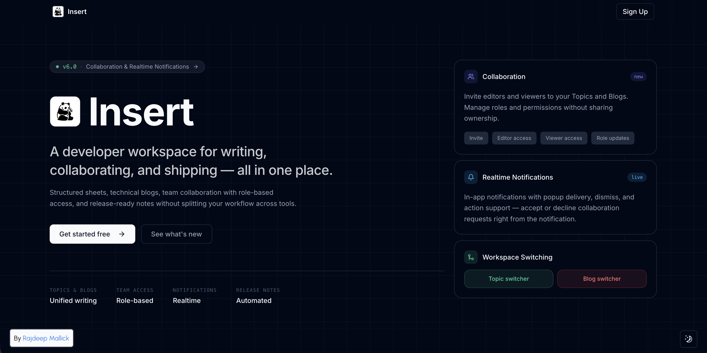
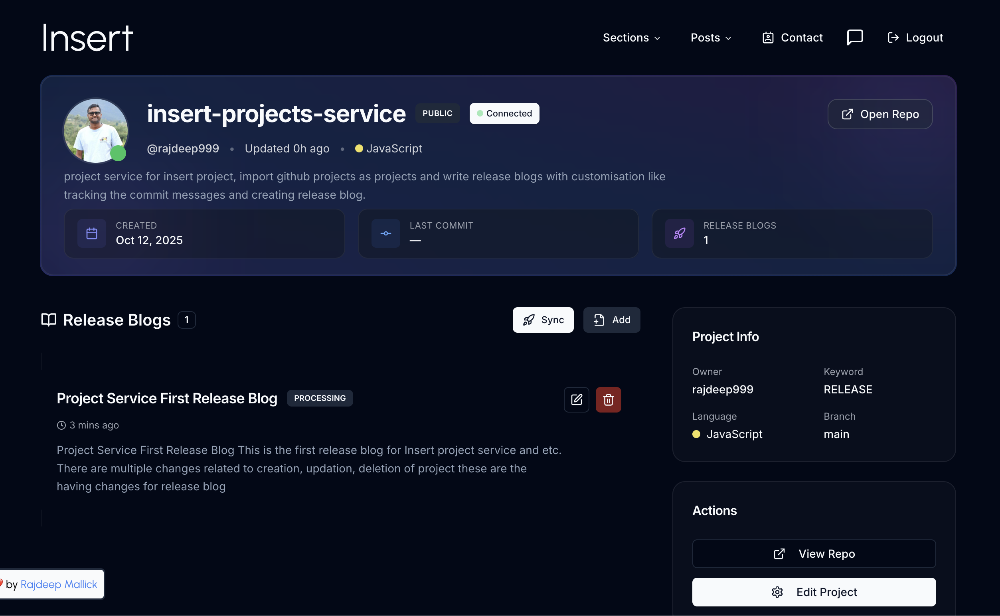

<p align="center">
  
</p>

<h1 align="center">Insert (v7.0)</h1>

<p align="center">
  A connected developer workspace for structured coding sheets, technical writing, typed collections, collaboration, and release-ready project workflows.
</p>

<p align="center">
  
  
  
  
  
  
</p>

## Overview

Insert is a full-stack developer publishing platform built around one idea: coding notes, blog writing, collections, and project release communication should not live in separate disconnected tools.

The current app combines:

- structured topic-based coding sheets
- a markdown-friendly technical writing flow
- topic-only and blog-only Collection V2 workspaces
- role-based topic and blog collaboration workflows
- project dashboards with release blog automation
- Pro-gated higher-scale publishing and project tooling

This repository is the main Next.js application for Insert. It handles the core product UI, authentication, app-router APIs, topic/blog flows, and integrates with external project, payment, and notification services.

## What Is New

Version 7 brings the main product surfaces into one cohesive visual and technical system:

- Collection V2 with an immutable `BLOG` or `TOPIC` kind selected at creation
- dedicated collection detail workspaces with accordion sheets and AG Grid topic rows
- modern topic, blog, project, profile, collaboration, membership, release, and authentication screens
- redesigned project release readers that use the available viewport without horizontal scrolling
- a responsive shadcn-based application navigation system
- role-based collaboration management, realtime notifications, and shared access summaries
- stricter authentication boundaries for private pages, including a server-side Collaboration guard
- refreshed skeletons, empty states, loading states, privacy policy, landing page, and footer
- clearer Pro status handling that distinguishes active membership from expired history

## Product Areas

### 1. Coding Sheets

Create topic-based coding sheets, group problems, manage structure, and collaborate without losing context.

- topic creation and organization
- problem add/edit/delete flows
- collaborator support on topics
- problem-level blog references
- activity tracking with profile heatmaps

<p align="center">
  
</p>

### 2. Technical Writing

Write technical blogs in a focused editor, keep drafts private, and publish when the writing is ready.

- markdown-friendly editing flow powered by Tiptap
- draft and publish controls
- title and visibility editing
- user blog feeds and profile integration

<p align="center">
  
</p>

### 3. Collection V2

Create a collection for one content type and turn related topics or blogs into a focused, shareable workspace.

- topic-only or blog-only collection creation
- metadata-only collection editing
- public and private visibility
- public collection feed and dedicated detail pages
- accordion-based sheets with AG Grid topic tables
- content-type and visibility badges throughout the UI

<p align="center">
  
</p>

### 4. Projects And Release Workflows

Connect project metadata to release communication. Insert integrates with an external project service and supports project detail views, release blogs, and release-note oriented workflows.

- project dashboard and project detail pages
- project metadata and release blog management
- release-note workflows backed by commit and repository context
- project-service integration with dedicated external endpoints

<p align="center">
  
</p>

### 5. Pro Experience

Insert keeps the core writing workflow intact while reserving higher-scale publishing and project automation for Pro.

- cross-workspace Pro unlock behavior
- Pro-first project and release tooling
- clearer active vs expired badge state
- improved presentation across subscription and profile surfaces

<p align="center">
  
</p>

## Latest Release Snapshot

The current release is **v7.0**, a major UI and workflow update spanning the complete Insert workspace.

```txt
feat(collection-v2): typed topic/blog collections + dedicated sheet views
feat(collaboration): role-based workspace + realtime request handling
feat(projects): modern project and release journal experience
feat(ui): unified navigation, profiles, membership, auth, releases, and landing
chore(access): private application routes fail closed
```

See the complete release story at [`/release/v7`](http://localhost:3000/release/v7) when running the application locally.

## Tech Stack

### Frontend And App Layer

- Next.js 14 App Router
- React 18
- TypeScript
- Tailwind CSS
- Radix UI primitives
- Tiptap editor
- NextAuth.js
- Axios
- React Hook Form + Zod
- AG Grid

### Data And Services

- MongoDB + Mongoose
- Firebase Realtime Database for heatmap and activity data
- Cloudinary for image uploads
- external project service
- external payment service
- external notification service

### UI And Interaction

- lucide-react icons
- Swiper
- AG Grid
- react-calendar-heatmap
- react-tooltip

## Architecture

Insert combines local app-router APIs with external services:

- main Next.js app for the core product UI and app APIs
- project service for project and release data
- payment service for subscription flows
- notification service for notifications and suggestion delivery
- Cloudinary for uploads
- Firebase for activity aggregation

The external service configuration lives in [src/lib/config/services.ts](src/lib/config/services.ts).

Detailed directory ownership, dependency rules, naming conventions, and verification commands are documented in [docs/architecture.md](docs/architecture.md).

The isolated topic/blog collection contract and V2 endpoints are documented in [docs/collection-v2.md](docs/collection-v2.md).

## Key Workflows

### Writing flow

1. Create a topic or blog draft.
2. Organize problems, notes, and references.
3. Keep content private while iterating.
4. Publish posts or bundle them into a collection.
5. Share a deep link to the final blog, topic, project, or collection.

### Project release flow

1. Connect or manage a project.
2. Pull project context from the project service.
3. Generate or manage release blog entries.
4. Review release-facing content inside Insert.
5. Publish and share outward-facing release notes.

## Repository Structure

```txt
src/
  app/                Next.js App Router pages and API routes
  components/         UI, landing sections, dialogs, cards, heatmap, etc.
  features/           Provider-based modules for blog/topic/project/user flows
  helpers/            Small shared helpers
  hooks/              Custom React hooks
  lib/                Config, db/auth utilities, shared app logic
  mail-templates/     Email templates
  model/              Mongoose models
  schemas/            Zod validation schemas
  styles/             Shared style assets
  types/              TypeScript types
  utils/              Mail, socket, and generic utilities
public/               Static assets
```

## Getting Started

### Prerequisites

- Node.js 18+
- npm
- MongoDB database
- Firebase project
- Cloudinary account
- NextAuth secret
- access to the external project, payment, and notification services for full local workflow support

### Install

```bash
npm install
```

### Environment

Create a `.env.local` file and provide the values your setup needs.

At minimum, the app expects environment values for:

- NextAuth secret and app URL
- Mongo connection string
- Firebase public config
- Cloudinary public upload config
- project service origin
- payment service origin
- notification service origin
- any email and payment provider credentials you use locally

The service origins are read from environment variables and fall back to the hosted service endpoints if not overridden.

### Run Locally

```bash
npm run dev
```

Open `http://localhost:3000`.

## Scripts

```bash
npm run dev      # start local development server
npm run build    # production build
npm run start    # run production server
npm run lint     # run Next.js linting
```

## Screens

### Overview

<p align="center"></p>

### Projects

<p align="center"></p>

### Collection V2

<p align="center"></p>

### Individual Collection

<p align="center"></p>

## Why Insert

Most developer writing tools stop at either notes, blogs, or project release updates.
Insert treats them as one connected system:

- sheets feed writing
- writing feeds collections
- projects feed release notes
- publishing and sharing stay inside one product surface

## Notes

- This repo is the main application, not the separate browser extension workspace.
- Some flows depend on external services being available.
- Private routes are protected by middleware; sensitive surfaces such as Collaboration also enforce a server-side session guard.

## Contributing

If you find a bug, UX issue, or workflow gap, open an issue or send improvements. The product has been evolving quickly, especially around collections, release tooling, and sharing.

---

<p align="center">
  Built with Insert.
</p>
